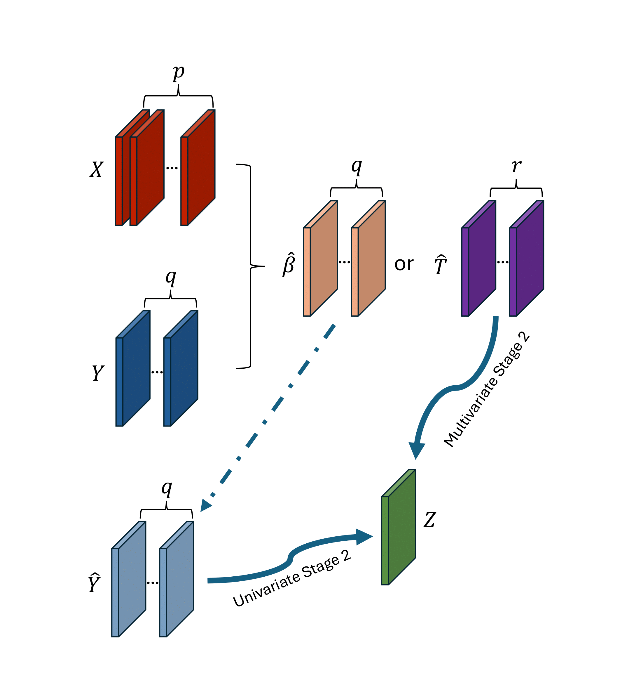

# 2-stage approaches for modelling Multi-Omics
## Overview

The codes are used for simulation study by 2-stage approaches. There are
3 methods in total:

1.  Univariate method

    Stage 1: Obtain $\hat{Y}$ from $X$ by Lasso regression.

    Stage 2: Predict $Z$ from $Y$ by Ridge regression.

2.  Multivariate methods — O2PLS

    Stage 1: Estimate the joint components $T$.

    Stage 2a: Use linear regression to predict the outcome variable by
    $\hat{T}$.

    Stage 2b: Raise the components number $r$, use Ridge regression
    instead of linear regression.

3.  Multivariate methods — PO2PLS

    Stages are same as O2PLS. Here, PO2PLS has distribution assumption,
    and estimates the parameters by maximum likelihood.

## Simulation Designs

1.  Design 1

    Generate the samples by PO2PLS, the samples are normally
    distributed.

2.  Design 2

    Generate $X$ same as before once and fixed, then use $X$ to generate
    $Y$ and $Z$ by principal components.

3.  Design 3

    Consider categorical variables $X$, generating by
    [Cosi2](https://software.broadinstitute.org/mpg/cosi2/cosidoc.html#orgheadline1)
    simulator.
